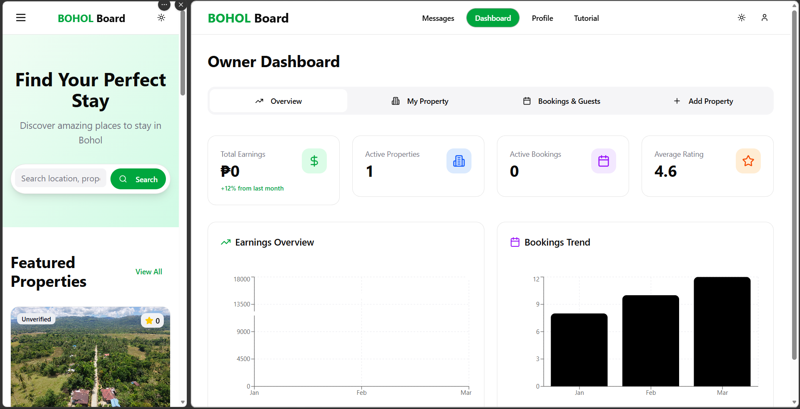

 
 
 # 🏠 Boarding House Finder Web App (Bohol)

A web-based platform designed to help students in Bohol find safe, affordable, and verified boarding houses. The system connects students and boarding house owners in one centralized platform with search, map, messaging, and booking features.

---

## 📌 Features

- 🔍 Search boarding houses by location or school  
- 🗺️ Interactive map (OpenStreetMap integration)  
- 📩 Direct messaging between student and owner  
- 🧾 Detailed boarding house listings (photos, price, amenities)  
- 📱 Mobile-responsive design  
- 🛡️ Verified listings to help prevent scams  
- 📅 Booking system for reservations  

---

## 🛠️ Tech Stack

- **Frontend:** React (JavaScript)  
- **Map API:** OpenStreetMap  
- **Email Service:** EmailJS / Email API  
- **Database:** Supabase  
- **Hosting:** GitHub Pages  

---

## ⚙️ How to Setup

1. Clone the repository:
```bash 
git clone https://github.com/SamNahutdo/BoardingHouse.git
```

2. Go to project folder:
```bash 
cd BoardingHouse
```

3. Install dependencies:
```bash 
npm install
```

---

## ▶️ How to Run

Start development server:
```bash 
npm start
```

Build project:
```bash 
npm run build
```

Deploy:
```bash 
npm run dev
```

---

## 🧑‍💻 How to Use the Web App

### For Students:
1. Open the website  
2. Browse or search boarding houses  
3. Use filters (price, location, amenities)  
4. View details (photos, description, rules)  
5. Message the owner directly  
6. Click “Book Now” and submit booking request  
7. Wait for confirmation  

---

### For Owners:
1. Create and complete profile  
2. Add boarding house listings  
3. Upload photos and details  
4. Manage bookings through dashboard  
5. Accept or reject student requests  
6. Reply to messages  

---

## ⚠️ Problems Encountered & Solutions

### 1. Map not loading properly  
**Problem:** OpenStreetMap not displaying  
**Solution:** Fixed API integration and ensured map component renders properly  

### 2. Email not working  
**Problem:** Messages not being sent  
**Solution:** Fixed EmailJS/API configuration and keys  

### 3. Supabase connection issues  
**Problem:** Data not loading or saving  
**Solution:** Verified database credentials and table structure  

### 4. Mobile responsiveness issues  
**Problem:** UI breaks on small screens  
**Solution:** Improved CSS and responsive layout design  

---

## 🧪 Technologies Used

- React JS – Frontend framework  
- OpenStreetMap – Map integration  
- EmailJS – Messaging system  
- Supabase – Backend database  
- GitHub Pages – Deployment  

---

## 🚀 Future Improvements

- User authentication system (advanced roles)  
- Rating and review system  
- Booking payment integration  
- Advanced filtering system  
- Admin dashboard for full system control  

---

# 🎤 SYSTEM PRESENTATION SCRIPT

---

## PART 1 — INTRODUCTION

Good day everyone.  
We are presenting the **Bohol Boarding House Finder**, a system designed to help students find safe and affordable boarding houses in Bohol.

Many students face problems such as:
- Being scammed  
- Overpaying for poor conditions  
- Difficulty finding trusted housing options  

This system solves that by providing a centralized and verified platform for boarding house listings.

The system allows students to:
- Search boarding houses easily  
- View real photos and details  
- Contact owners directly  
- See locations on a map  
- Book safely without middlemen  

This platform is built specifically for students, especially freshmen and transferees in Bohol.

---

## PART 2 — STUDENT GUIDE

When the user opens the system, they will see the home page with featured listings and search options.

### Map Feature
Students can view all boarding houses on an interactive map and locate them easily.

### Search & Filters
Users can filter by:
- Price range  
- Location  
- Room type  
- Amenities  

### Messaging
Students can directly message owners for inquiries and details.

### Booking Process
1. Select a boarding house  
2. View details  
3. Click “Book Now”  
4. Submit booking request  
5. Wait for approval  
6. Receive confirmation  

---

## PART 3 — OWNER GUIDE

Owners can manage their boarding houses through the system.

### Dashboard Features
- Add new boarding house listings  
- Edit or remove properties  
- View booking requests  
- Accept or reject students  

### Messaging
Owners can communicate directly with students for inquiries or arrangements.

This gives owners full control over their properties and tenants.

---

## PART 4 — CONCLUSION

This system helps solve real problems faced by students in finding safe housing.

It provides:
- Safety from scams  
- Centralized listings  
- Faster and easier searching  
- Direct communication with owners  

It also benefits owners by giving them a platform to manage and promote their boarding houses professionally.

---

## PART 5 — TECHNOLOGY USED

This system is built using:

- **React JS** – For fast and responsive user interface  
- **Supabase** – For database, authentication, and storage  
- **OpenStreetMap** – For location mapping  
- **Email API** – For messaging and notifications  

Together, these technologies create a modern, fast, and scalable system.

---

## 📬 Live Demo

👉 https://samnahutdo.github.io/BoardingHouse/

---

## 📁 Repository

👉 https://github.com/SamNahutdo/BoardingHouse
